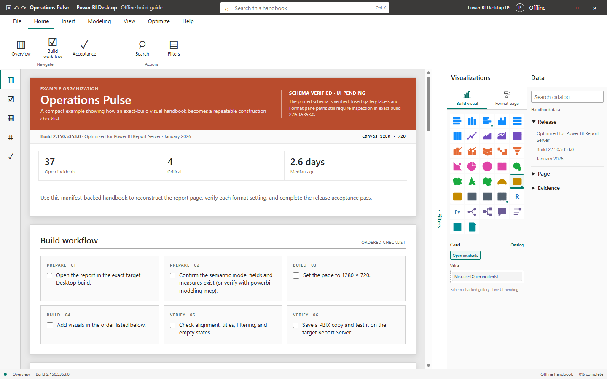
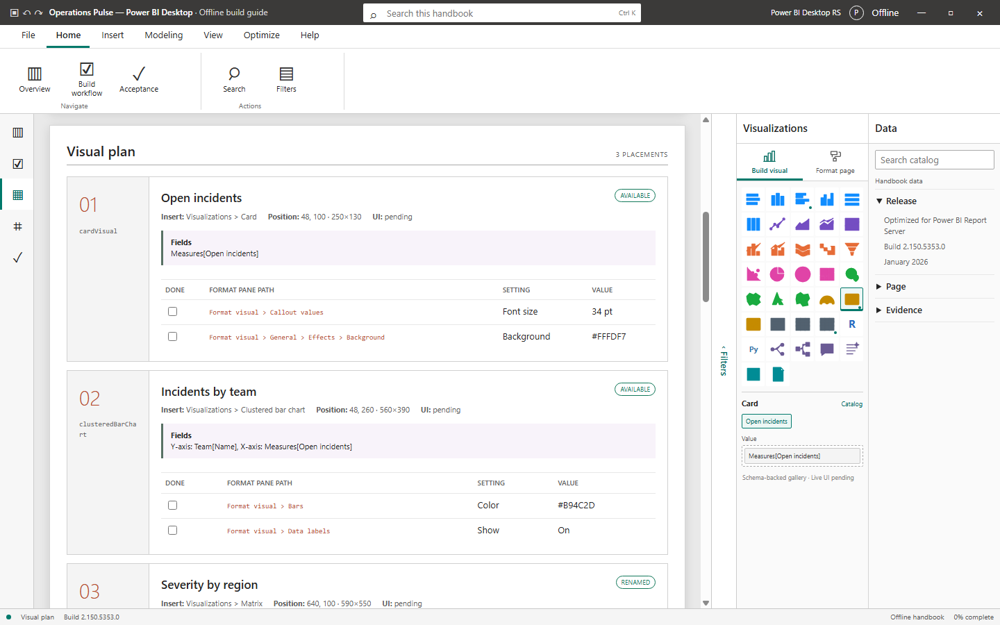
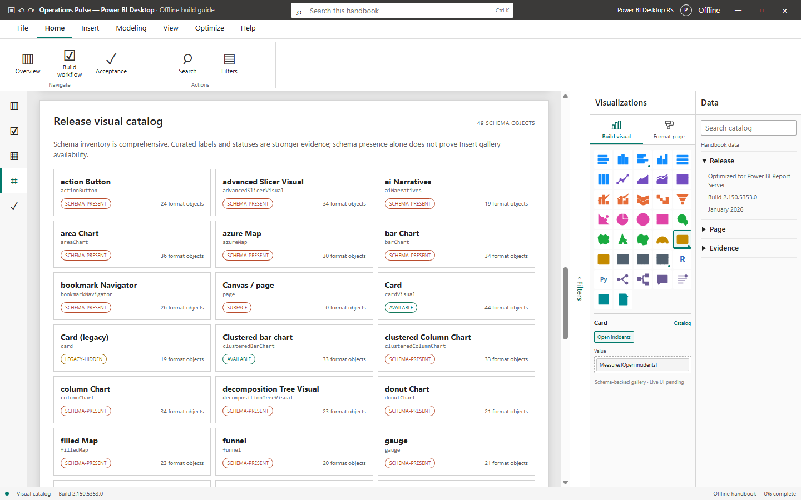
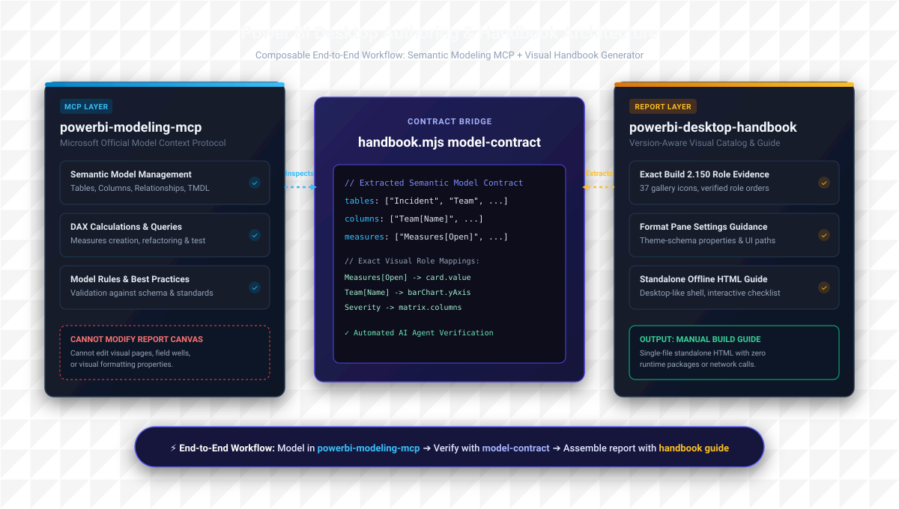

# Power BI Desktop Handbook

Build version-aware, standalone report-construction handbooks that feel like Microsoft Power BI Desktop in the browser.

The project combines a pinned Power BI visual schema, curated release evidence, manifest validation, and an offline HTML generator. Its first release profile targets **Microsoft Power BI Desktop optimized for Power BI Report Server — January 2026**, build `2.150.5353.0`.



## What it provides

- A release-aware catalog of Power BI visuals, aliases, availability states, and format objects.
- Exact-build detection for the locally installed Report Server Desktop executable.
- Validation for report page dimensions, visual types, placement bounds, and format-setting assertions.
- A shared Power BI Desktop-style web shell with a ribbon, section rail, report workspace, and inspector panes.
- A 37-item visual gallery with a curated, two-tone SVG palette organized by visual family.
- Exact-build field-role evidence for 30 gallery visuals, with seven modeled entries explicitly pending when the classic gallery did not expose them directly.
- Backward-compatible legacy and structured field assignments normalized against exact-release Build-role evidence.
- Global handbook search, catalog filtering, visual navigation, persistent checklists, responsive layouts, and print-ready output.
- A single generated HTML file with no runtime packages or network dependencies.

## Quick start

Install Node.js 20 or newer. No package installation is required.

```powershell
npm test
npm run validate
npm run audit:public
node plugins/powerbi-desktop-handbook/skills/powerbi-desktop-handbook/scripts/handbook.mjs detect --json
node plugins/powerbi-desktop-handbook/skills/powerbi-desktop-handbook/scripts/handbook.mjs lookup --release 2.150.5353.0 --visual Matrix --json
node plugins/powerbi-desktop-handbook/skills/powerbi-desktop-handbook/scripts/handbook.mjs build --manifest examples/sample-dashboard.json --output examples/sample-dashboard-guide.html --json
```

Open `examples/sample-dashboard-guide.html` directly in a browser. The generated handbook works through `file://` and does not require a local server.

## CLI

The entrypoint is:

```text
plugins/powerbi-desktop-handbook/skills/powerbi-desktop-handbook/scripts/handbook.mjs
```

| Command | Purpose |
| --- | --- |
| `detect` | Compare the installed Desktop executable with a target release. |
| `catalog` | List the release's schema-derived and curated visual catalog. |
| `lookup --visual NAME` | Resolve a gallery label, alias, or internal visual identifier. |
| `validate --manifest FILE` | Validate a handbook manifest without generating output. |
| `build --manifest FILE --output FILE` | Validate and generate a standalone HTML handbook. |
| `model-contract --manifest FILE` | Extract required semantic model tables, columns, and measures. |

Commands accept `--json`. Release-aware commands accept `--release VERSION`; the default is `2.150.5353.0`.

## Building a handbook

Start with `examples/sample-dashboard.json`. A manifest defines:

- Handbook identity, title, organization, subtitle, and target release.
- Report page dimensions and brand colors.
- Snapshot metrics displayed on the overview canvas.
- Visual types, coordinates, fields, format-pane paths, values, and notes.
- Ordered preparation steps and final acceptance checks.

Visual fields can remain concise legacy strings or use structured metadata. Both forms are normalized into the generated handbook payload:

```json
"fields": [
  "Y-axis: Team[Name]",
  {
    "role": "xAxis",
    "field": "Measures[Open incidents]",
    "kind": "measure",
    "aggregation": null
  }
]
```

Structured assignments accept `column`, `measure`, `hierarchy`, or `unknown` as `kind`; omitted kinds normalize to `unknown`. Role IDs and displayed role labels are matched against the exact-release Build visual reference. Legacy strings without a role prefix use the first verified role for that visual, while unverified or unknown roles remain valid with validation warnings.

The manifest remains unchanged in the generated payload. Each enriched visual also receives a normalized `fieldAssignments` array whose entries have this stable shape:

```json
{
  "role": "yAxis",
  "field": "Team[Name]",
  "kind": "column",
  "aggregation": null
}
```

The payload's top-level `buildRoles` property contains the complete exact-release reference, including verified and pending visuals. A normalized role is the canonical role ID, or `null` when an unprefixed legacy field has no verified role to inherit. Legacy fields normalize to `kind: "unknown"` and `aggregation: null` because the generator does not infer metadata that the manifest or evidence does not establish.

Malformed structured assignments fail validation. Unknown roles, duplicate assignments, known single-role capacity overflow, and known required roles left empty are warnings so incomplete manual guides remain buildable. Capacity and required-role warnings are emitted only when the curated reference explicitly establishes those constraints.

Validate before building:

```powershell
node plugins/powerbi-desktop-handbook/skills/powerbi-desktop-handbook/scripts/handbook.mjs validate --manifest examples/sample-dashboard.json --json
```

Then generate the guide:

```powershell
node plugins/powerbi-desktop-handbook/skills/powerbi-desktop-handbook/scripts/handbook.mjs build --manifest examples/sample-dashboard.json --output examples/sample-dashboard-guide.html --json
```

Generated guides should be rebuilt from their manifests. Avoid editing generated HTML directly when the change belongs in a manifest or the shared shell.

## Desktop-style interface

The shared shell mirrors the structure of the target Desktop release without depending on screenshots or Microsoft-hosted assets:

- The title bar provides global search and release context.
- Ribbon tabs expose real navigation, filtering, printing, and checklist actions.
- The left rail tracks the active handbook section.
- The central workspace renders overview, workflow, visual plan, catalog, and acceptance pages.
- Filters, Visualizations, and Data panes expose evidence filters, a release-aware visual gallery with manifest field wells, page-format guidance, placement navigation, and build metadata.
- Narrow screens use a drawer-based inspector and bottom navigation.
- Print mode removes application chrome and produces a clean build document.

Manifest brand colors apply to report content; the surrounding application chrome remains neutral and consistent across generated handbooks.



### Visual gallery palette

All 37 gallery entries have an explicit primary and accent color. Core chart families use consistent blue, violet, orange, magenta, green, amber, or slate pairs; R, Python, AI, scorecard, and paginated-report visuals retain distinct accents. The palette is applied with CSS variables in the shared shell, so the existing SVG geometry and the standalone offline format remain unchanged.



Hover, selected, focused, and used states preserve each icon's assigned colors. Regression coverage verifies the complete gallery mapping, rejects missing or duplicate assignments, and checks primary, accent, outline, hover, and selected behavior.

The palette is Power BI-like application styling, not exact-live-UI evidence. Gallery availability and interface instructions continue to use the evidence states described below.

## Evidence model

The project deliberately keeps different kinds of evidence separate:

| State | Meaning |
| --- | --- |
| Available | Curated evidence expects the visual in the Insert gallery for the release family. |
| Legacy hidden | Existing report JSON may contain the visual, but new reports should use its replacement. |
| Renamed | The gallery label differs from the internal schema identifier. |
| Schema present | The pinned schema defines the object; gallery presence is not proven. |
| Live UI pending | The exact target interface has not yet been inspected for the stated instruction. |
| Exact live UI | The label or field-role claim was observed in Desktop build `2.150.5353.0` using the stated locale and interaction mode. |
| Build-role pending | The modeled gallery entry was not exposed as a direct icon during the exact-build classic-gallery inspection; this is not an unsupported claim. |

Installation detection is not UI certification. A matching executable proves the build is present, but Insert-gallery labels and Format pane paths remain pending until the actual interface is checked.

The release-specific Build-role contract is stored under `references/build/`. It records the exact `en-US` classic Visualizations-pane labels and role ordering observed for 30 of the 37 modeled gallery entries. Requiredness, capacity, accepted field kinds, and default aggregation stay unknown unless directly demonstrated. Manifest validation and handbook generation load this exact-release contract; generated payloads expose it as `buildRoles` and use it to normalize `fieldAssignments` without upgrading pending evidence into verified guidance.

Important naming distinctions:

- Matrix is the user-facing name for the `pivotTable` schema object.
- Current Card is `cardVisual`.
- Legacy Card is `card`.
- Multi-row card is `multiRowCard`.

Power BI Desktop optimized for Report Server primarily saves PBIX. This project does not claim PBIP/PBIR round-trip authoring support for that edition, and generated handbooks do not modify PBIX report canvases.

## Compatibility with powerbi-modeling-mcp

This project is designed to work hand-in-hand with Microsoft's official [Power BI Modeling MCP Server](https://github.com/microsoft/powerbi-modeling-mcp) ([`@microsoft/powerbi-modeling-mcp`](https://www.npmjs.com/package/@microsoft/powerbi-modeling-mcp)).



### Division of responsibility

| Responsibility | Handled by `powerbi-modeling-mcp` | Handled by `powerbi-desktop-handbook` |
| --- | --- | --- |
| Semantic model authoring | Yes (tables, columns, measures, DAX, relationships, TMDL) | No (documents field assignments) |
| DAX query testing & validation | Yes (via local or hosted MCP tools) | No |
| Report visual canvas modifications | No (cannot edit report pages or diagram layouts) | Yes (guided manual construction & exact field wells) |
| Exact-build visual catalog & roles | No | Yes (pinned build 2.150.5353.0 gallery & Build roles) |
| Format pane property guidance | No | Yes (theme-schema-backed paths & UI assertions) |
| Standalone offline construction handbook | No | Yes (single-file HTML with interactive checklists) |

### Recommended agent workflow

1. **Model Authoring**: An AI agent connects to Power BI Desktop, Fabric, or a PBIP/TMDL folder using `powerbi-modeling-mcp` to create tables, columns, DAX measures, and relationships.
2. **Contract Extraction**: Run `model-contract` to extract the semantic model requirements declared by a report manifest:
   ```powershell
   node plugins/powerbi-desktop-handbook/skills/powerbi-desktop-handbook/scripts/handbook.mjs model-contract --manifest examples/sample-dashboard.json --json
   ```
   This returns the distinct required tables, columns, and measures, plus the visuals and field roles that reference them.
3. **Model Alignment**: The AI agent verifies against the live semantic model via `powerbi-modeling-mcp` (e.g., using `GetSemanticModelSchema`) to ensure all referenced objects exist before reporting is constructed.
4. **Visual Guide Generation**: Validate the manifest and generate the standalone offline handbook:
   ```powershell
   node plugins/powerbi-desktop-handbook/skills/powerbi-desktop-handbook/scripts/handbook.mjs build --manifest examples/sample-dashboard.json --output examples/sample-dashboard-guide.html --json
   ```

### MCP client configuration

To enable the Power BI Modeling MCP Server in your MCP client (e.g. VS Code Copilot, Claude Desktop, Antigravity, or Cursor), add the following configuration:

```json
{
  "mcpServers": {
    "powerbi-modeling": {
      "type": "stdio",
      "command": "npx",
      "args": [
        "-y",
        "@microsoft/powerbi-modeling-mcp@latest",
        "--start"
      ]
    }
  }
}
```

## Repository layout

```text
.agents/plugins/marketplace.json                         Local Codex marketplace entry
examples/                                               Publishable manifests and generated examples
plugins/powerbi-desktop-handbook/                       Installable plugin
  skills/powerbi-desktop-handbook/
    assets/handbook-shell.html                          Shared offline interface
    references/                                         Release, build-role, visual, guide, and schema evidence
    scripts/handbook.mjs                                CLI and generator
test/                                                   Node test suite
AGENTS.md                                               Contributor and agent instructions
```

Keep private customer and operational manifests outside this public-ready repository.

## Verification

Before committing generator, template, catalog, or manifest changes:

```powershell
npm test
npm run validate
npm run audit:public
```

Rebuild affected handbooks and open them through `file://`. Check search, filters, navigation, checklist persistence, print output, and both desktop and mobile layouts.

The publication audit scans repository filenames and text content, including generated HTML, for credential assignments, private keys, local workspace paths, and unapproved usernames. To enforce custom organization- or customer-specific blocklists without committing sensitive names to public git history, place them in an ignored `local/audit-blocklist.json` or `private/audit-blocklist.json` file, or set the `PBI_AUDIT_BLOCKLIST` environment variable.

## Evidence sources

- Microsoft Power BI Report Server download profile: <https://www.microsoft.com/en-us/download/details.aspx?id=106035>
- Microsoft report-theme schema: <https://github.com/microsoft/powerbi-desktop-samples/tree/main/Report%20Theme%20JSON%20Schema>
- Microsoft visual documentation: <https://learn.microsoft.com/power-bi/visuals/power-bi-visualization-types-for-reports-and-q-and-a>

## Author

Created and maintained by [Pakorn K.](https://github.com/pakorn269). Employer and organizational affiliations are intentionally omitted from this public project.

## License

MIT
